# FGGRAPHY

> 랭킹 시스템을 도입한 영화 추천 플랫폼


## Member & Role

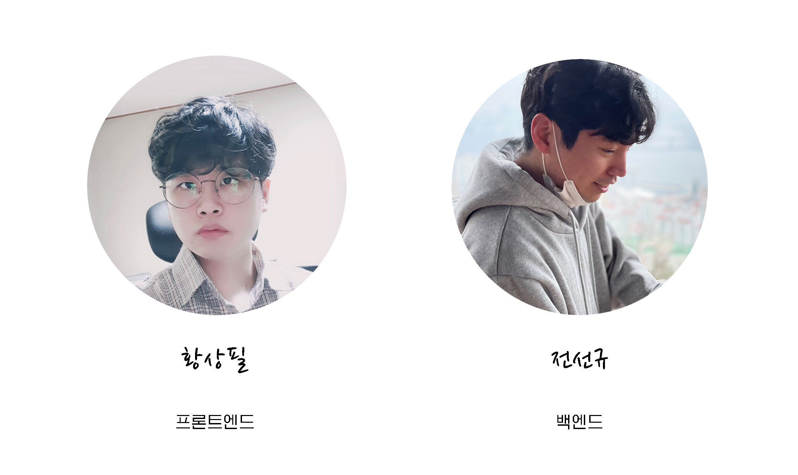

##### 황상필(팀장)

- FrontEnd
- Client UI/UX, SPA 로직 담당
- 발표자료 제작 및 발표

##### 전선규

- BackEnd
- Django API 서버 개발
- 로딩, 별점, 예고편 컴포넌트, 검색 기능 담당


## Project Summary

- ##### Duration

  Mar 20th 2021 ~ Mar 28th 2021 (9 days)

- ##### Purpose

  영화 평점, 리뷰 작성 플랫폼 내 랭킹 시스템을 도입하여 사용자에게 리뷰 작성 유인을 제공

- ##### Content

  전체 랭킹, 영화 장르별 랭킹(0~5티어)을 색깔로 구분하여 사용자에게 노출시킴

  상위 랭커의 추천 영화를 다른 사용자에게 노출시킴


## Setting

##### FrontEnd

- project setup

  ```bash
  $ npm install
  $ npm run serve
  ```

- set secret infos

  ```bash
  # /.env.local
  VUE_APP_SERVER_URL={my_localhost_ip}
  VUE_APP_YOUTUBE_API_KEY={my_youtube_api_key}
  ```

- start server

  ```bash
  $ npm run serve
  ```


##### BackEnd

- project setup

  ```bash
  $ pip install -r requirements.txt
  ```

- DB setting

  ```bash
  $ python manage.py migrate
  $ python manage.py loaddata fggraphy.json
  ```

- start server

  ```bash
  $ python manage.py runserver
  ```

  

## Tech Stack

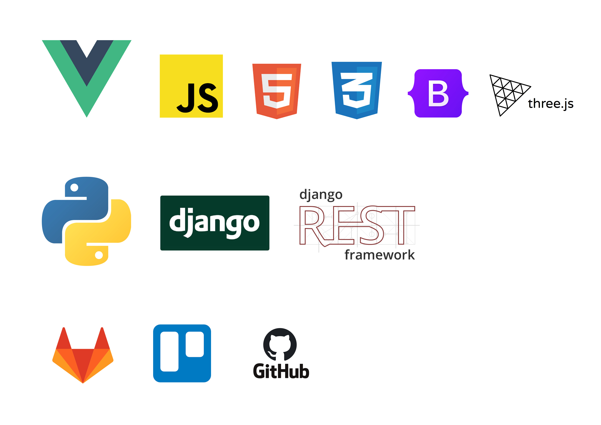

- FrontEnd : Vue, html, css, js, bootstap, threejs

- BackEnd : Python, Django, Django RestFramework,

- Collaboration Tool : Gitlab, Trello, Github


## ERD

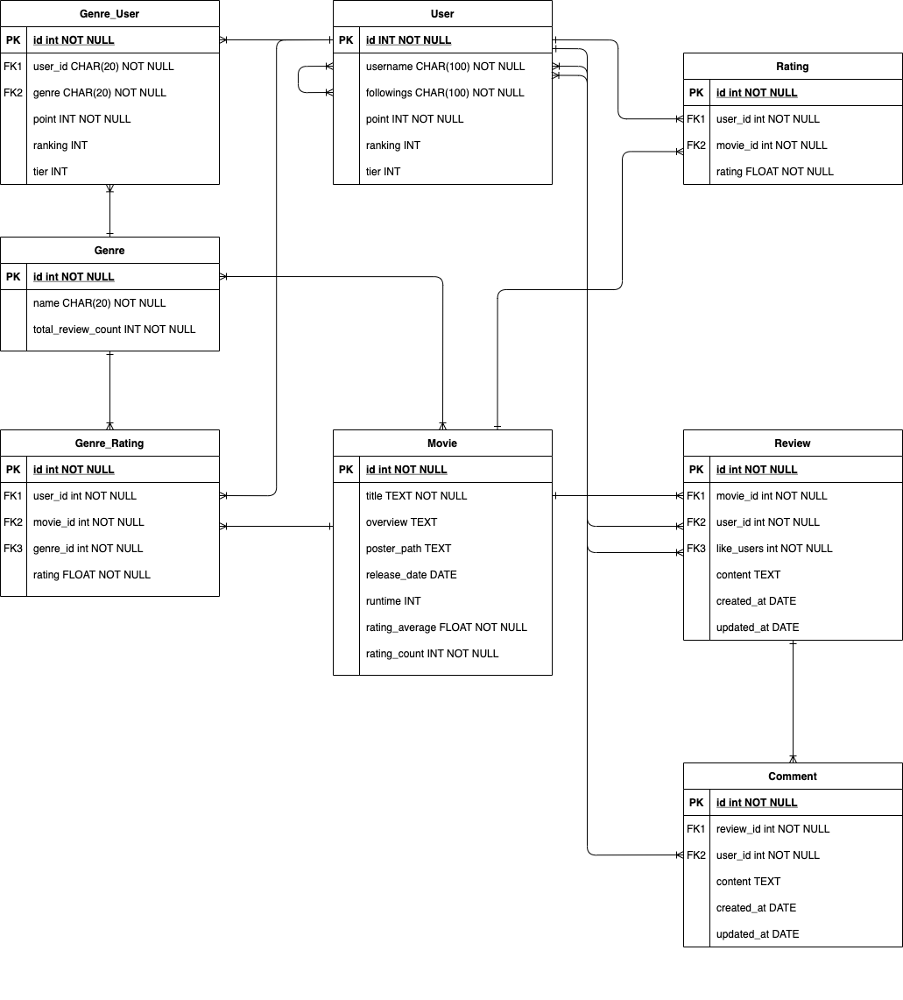


## Pages in Detail

🔸INDEX

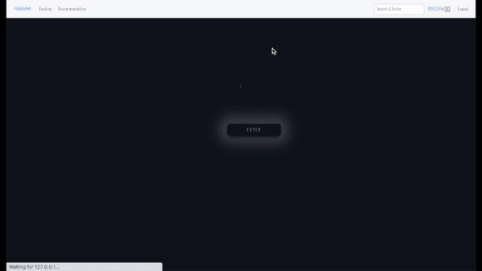


🔸회원가입

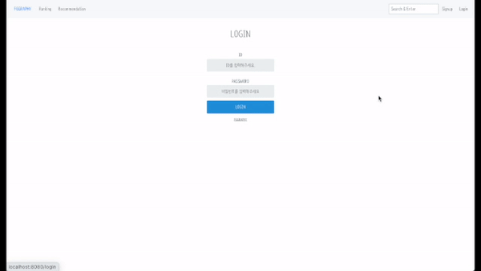


🔸로그인


🔸프로필

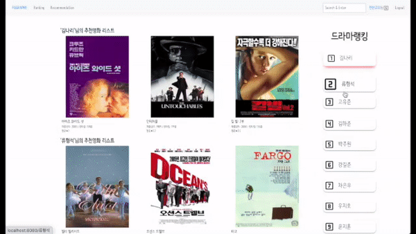


🔸전체 랭킹 페이지

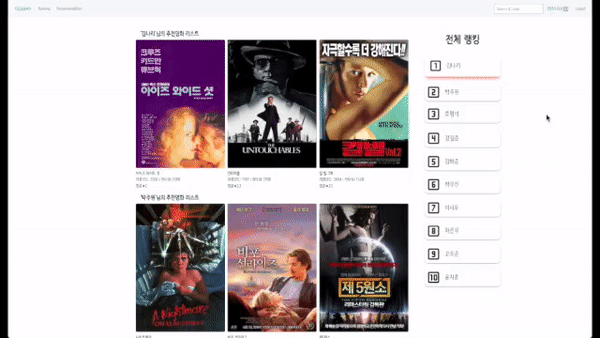


🔸장르별 전체 페이지

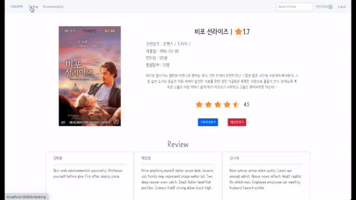


🔸추천


🔸영화 detail


🔸예고편 보기

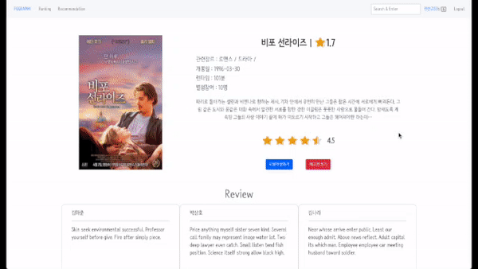


🔸평점 남기기

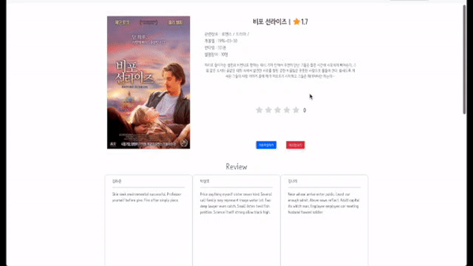


🔸리뷰/댓글 남기기

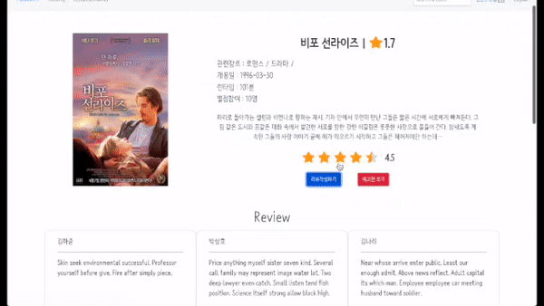

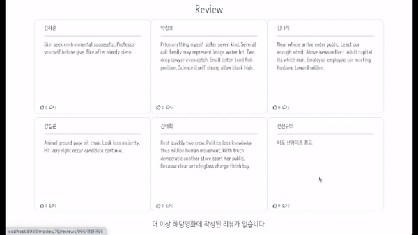


🔸검색

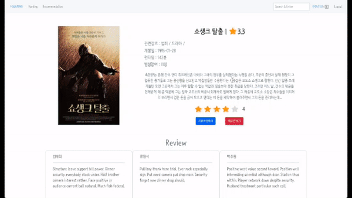


## Deploy

> not currently in active

- Server
  - AWS Cloud9(IDE)
  - AWS EC2(Instance)
  - AWS Router53(domain)
- client
  - Netlify 이용


